<div id="top"></div>

[![Contributors][contributors-shield]][contributors-url]
[![Forks][forks-shield]][forks-url]
[![Stargazers][stars-shield]][stars-url]
[![Issues][issues-shield]][issues-url]
[![MIT License][license-shield]][license-url]
[![LinkedIn][linkedin-shield]][linkedin-url]

<!-- PROJECT LOGO -->
<br />
<div align="center">
  <a href="https://github.com/SparklingWater45/MunchOut">
    
  </a>

<h3 align="center">MunchOut</h3>

  <p align="center">
    Restaurant event booking mobile application
    <br />
    <a href="https://github.com/SparklingWater45/MunchOut"><strong>Explore the docs »</strong></a>
    <br />
  </p>
</div>


<!-- TABLE OF CONTENTS -->
<details>
  <summary>Table of Contents</summary>
  <ol>
    <li>
      <a href="#about-the-project">About The Project</a>
      <ul>
        <li><a href="#built-with">Built With</a></li>
      </ul>
    </li>
    <li>
      <a href="#getting-started">Getting Started</a>
      <ul>
        <li><a href="#prerequisites">Prerequisites</a></li>
        <li><a href="#installation">Installation</a></li>
      </ul>
    </li>
    <li><a href="#documentation">Documentation</a></li>
    <li><a href="#cross-platform">Cross Platform</a></li>
    <li><a href="#license">License</a></li>
  </ol>
</details>


<!-- ABOUT THE PROJECT -->
## About The Project

Final year group project where a functional mobile application was to be created.
<br>
<br>
* "MunchOut" was designed to provide local restaurants a means of promoting and managing bookings from customers for any daily events they plan on hosting. 

* E.g. "20% off pizzas". Customers can then book for the event letting the restaurant know they are coming which in turn provides the restaurant with their details , such as name and phone number.

* Different set of menus for the user types:
  - Customer User
    + Can book for events and view differnet events having booked for
  - Restaurant User
    + Can create events , view created events and view customers coming to each event.
 

## Built With

### Frontend:
```
Framework - Flutter
Language - Dart
```
<code>  </code>
<code>  </code>

### Backend:
```
Language - Python
Framework - Flask
Database - MySQL
```
<code>  </code>
<code>  </code>
<code>  </code>

### Design
#### Figma 
```
https://www.figma.com/file/GJmIuobOWWiGpwq7ZIpiCe/ITMDA3-Mobile-App?node-id=0%3A1
```
<code>  </code>

<p align="right">(<a href="#top">back to top</a>)</p>


<!-- GETTING STARTED -->
## Getting Started

This is an example of how you may give instructions on setting up your project locally.
To get a local copy up and running follow these simple example steps.

### Prerequisites
#### Each folder contains its own installation instructions

Frontend folder contains the flutter client application code.
```
frontend/README.md
```
Backend folder contains the flask REST API apploication code.
```
backend/README.md
```
### Languages & FrameWork Installation

1. Install Flutter
  ```
  https://docs.flutter.dev/get-started/install
  ```

2. Install Python 3.8.9

  ```
  Tested using Python 3.8.9
  Later versions may cause failures. Packages may be imcompatibale
  https://www.python.org/downloads/release/python-389/
  ``` 

3. Clone the repo
  ```
   git clone https://github.com/SparklingWater45/MunchOut
  ```

<p align="right">(<a href="#top">back to top</a>)</p>

## Examples Screen Views

<div style="text-align: center">
    <table>
        <tr>
            <td style="text-align: center">
                    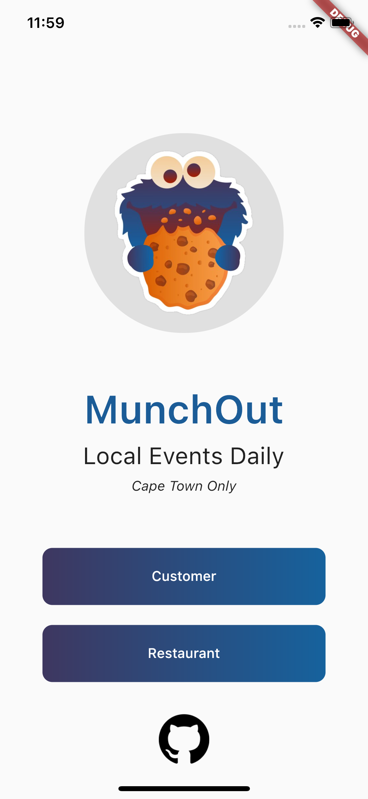
                </a>
            </td>            
            <td style="text-align: center">
                     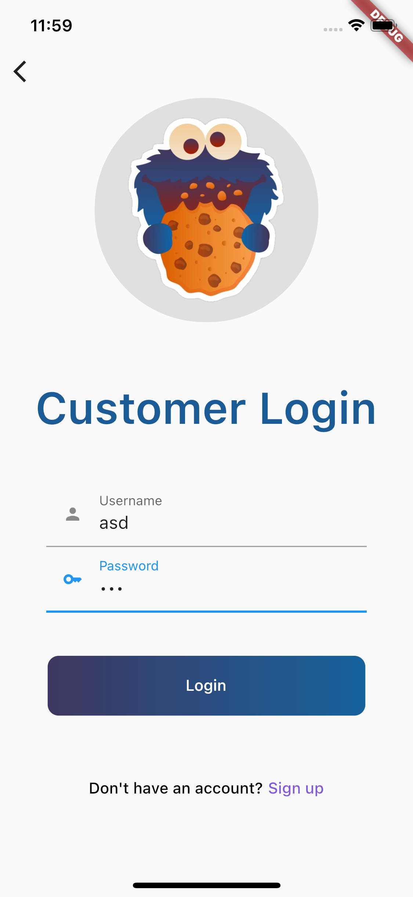
                </a>
            </td>
            <td style="text-align: center">
                    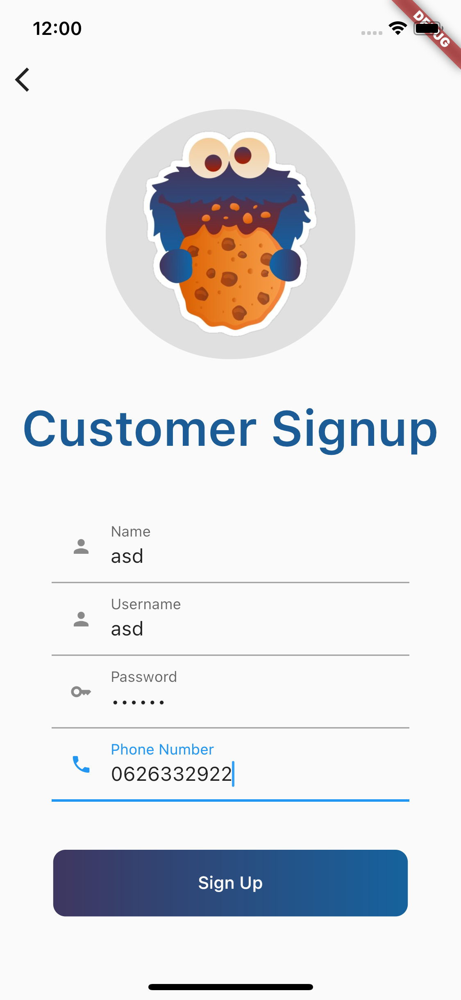
                </a>
            </td>
        </tr>
        <tr>
            <td style="text-align: center">
                    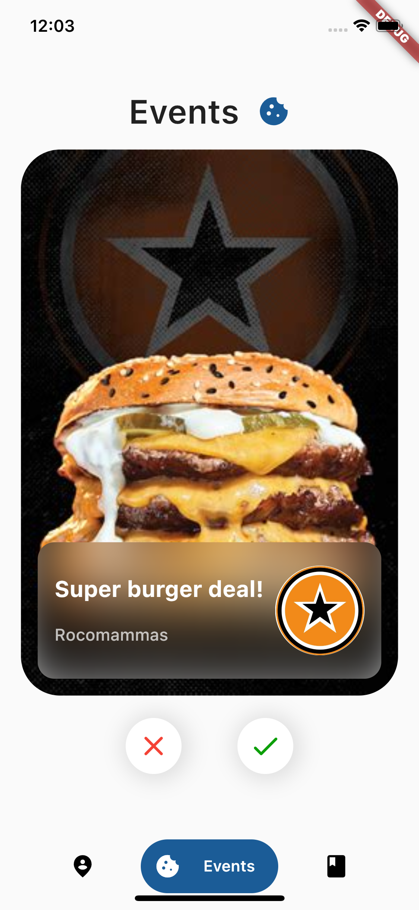
                </a>
            </td>
            <td style="text-align: center">
                    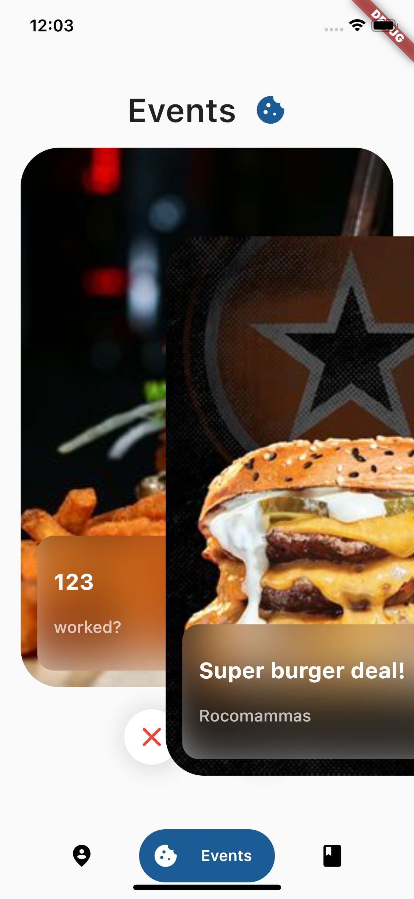
                </a>
            </td>
            <td style="text-align: center">
                    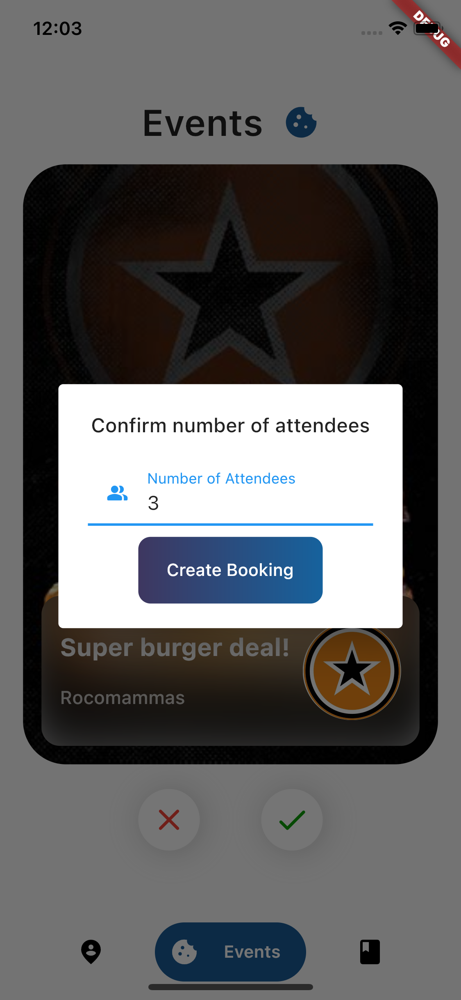
                </a>
            </td>
        </tr>
        <tr>
               <td style="text-align: center">
                    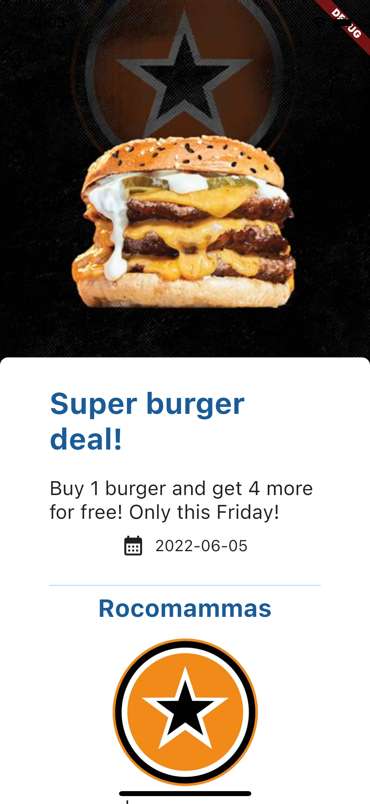
                </a>
            </td>
            <td style="text-align: center">
                    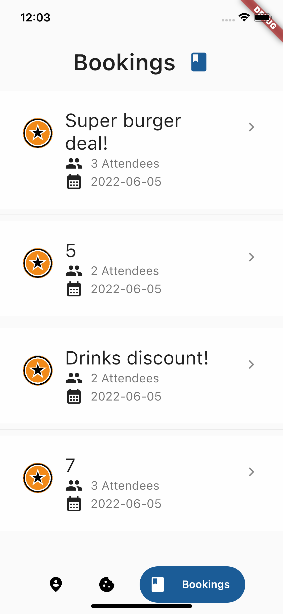
                </a>
            </td>
            <td style="text-align: center">
                    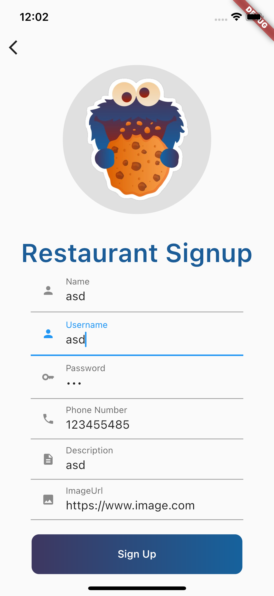
                </a>
            </td>
        </tr>
        <tr>
            <td style="text-align: center">
                    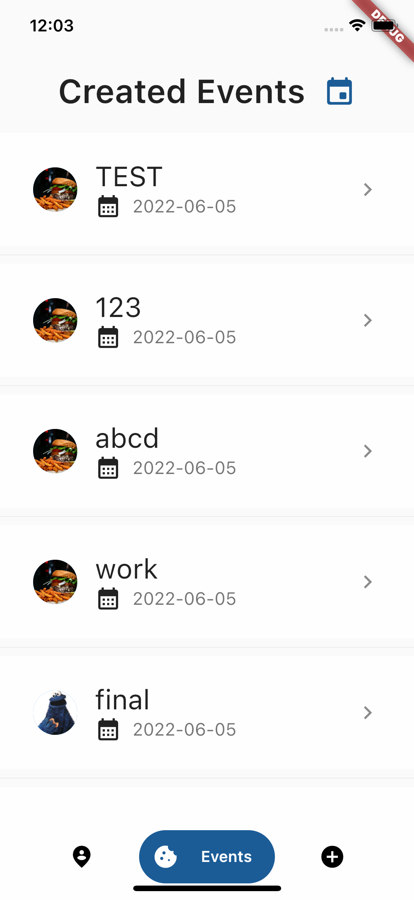
                </a>
            </td>
            </td>
            <td style="text-align: center">
                    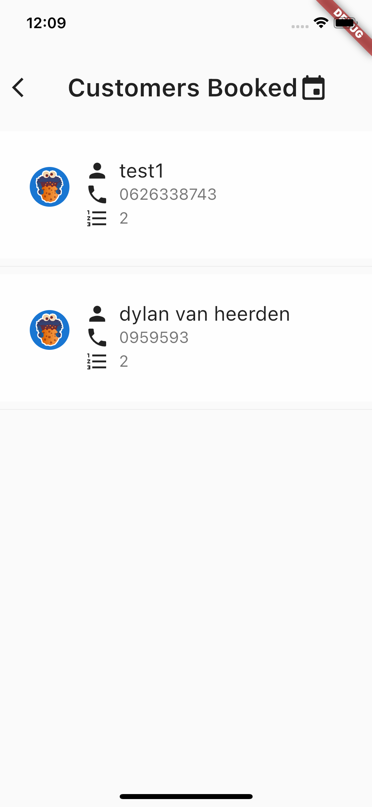
                </a>
            </td>
            <td style="text-align: center">
                    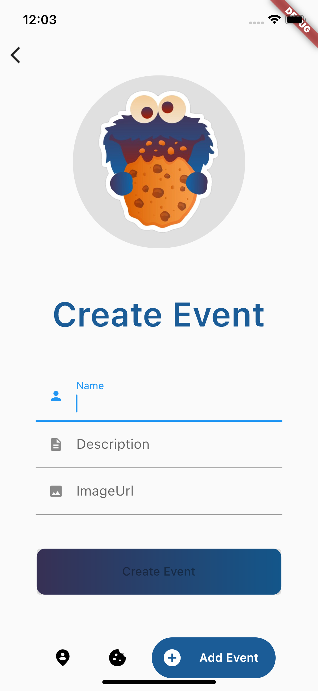
                </a>
            </td>
        </tr>
    </table>
</div>

<p align="right">(<a href="#top">back to top</a>)</p>


## Documentation
### Architecture
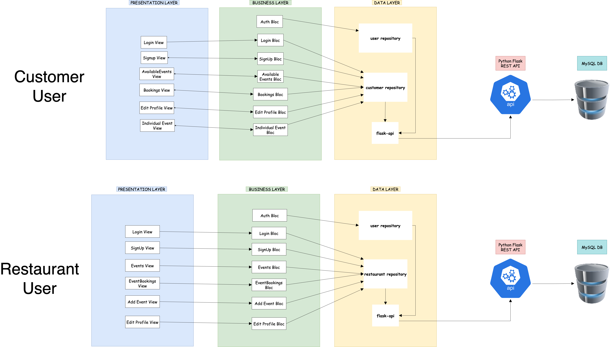

### ER Diagram
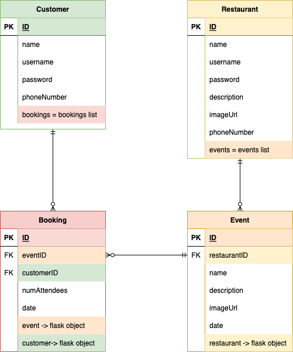

### Screens Flowchart
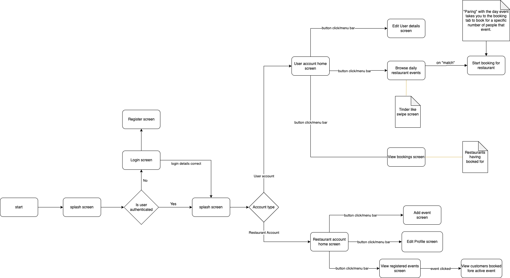

<!-- USAGE EXAMPLES -->
## Cross Platform
<div style="text-align: center">
    <table>
        <tr>
            <td style="text-align: center">
                    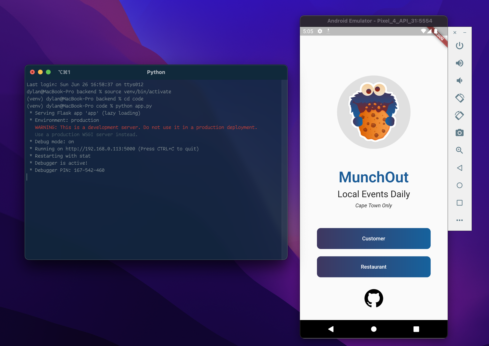
                    <p>Android</p>
                </a>
            </td> 
                <td style="text-align: center">
                    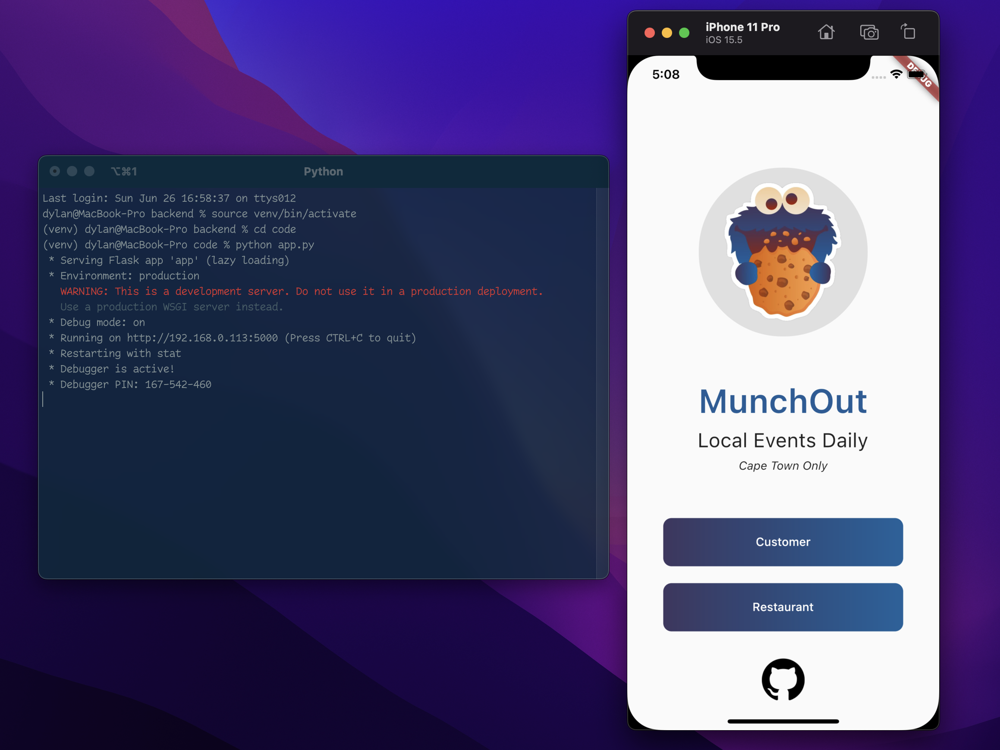
                    <p>IOS</p>
                </a>
            </td> 
        </tr>
    </table>
</div>


<p align="right">(<a href="#top">back to top</a>)</p>

<!-- LICENSE -->
## License

Distributed under the MIT License. See `LICENSE.txt` for more information.

<p align="right">(<a href="#top">back to top</a>)</p>


<!-- CONTACT -->
## Contact

Dylan van Heerden - [@Soda_Water45](https://twitter.com/Soda_Water45) - dylanvh45@gmail.com

Project Link: [https://github.com/SparklingWater45/MunchOut](https://github.com/SparklingWater45/MunchOut)

<p align="right">(<a href="#top">back to top</a>)</p>

<!-- MARKDOWN LINKS & images -->
<!-- https://www.markdownguide.org/basic-syntax/#reference-style-links -->
[contributors-shield]: https://img.shields.io/github/contributors/SparklingWater45/MunchOut.svg?style=for-the-badge
[contributors-url]: https://github.com/SparklingWater45/MunchOut/graphs/contributors
[forks-shield]: https://img.shields.io/github/forks/SparklingWater45/MunchOut.svg?style=for-the-badge
[forks-url]: https://github.com/SparklingWater45/MunchOut/network/members
[stars-shield]: https://img.shields.io/github/stars/SparklingWater45/MunchOut.svg?style=for-the-badge
[stars-url]: https://github.com/SparklingWater45/MunchOut/stargazers
[issues-shield]: https://img.shields.io/github/issues/SparklingWater45/MunchOut.svg?style=for-the-badge
[issues-url]: https://github.com/SparklingWater45/MunchOut/issues
[license-shield]: https://img.shields.io/github/license/SparklingWater45/MunchOut.svg?style=for-the-badge
[license-url]: https://github.com/SparklingWater45/MunchOut/blob/master/LICENSE.txt
[linkedin-shield]: https://img.shields.io/badge/-LinkedIn-black.svg?style=for-the-badge&logo=linkedin&colorB=555
[linkedin-url]: https://linkedin.com/in/dylan-van-heerden-a7b160139